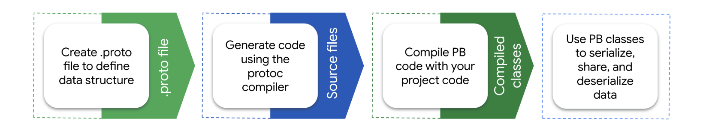

# 📘 Protocol Buffers 概览（Overview）

> 来源说明：[Protocol Buffers 官方文档中文站 — 概览](https://protobuf.com.cn/overview/) | 本节涵盖：Protobuf 是什么、解决了什么问题、适用/不适用场景、工作流程、`.proto` 定义语法与数据类型

---

## 🧠 核心概念总览（严格按原文顺序）
> 📎 返回：[QwenRPC 仓库首页](../README.md)

- [*知识点1: Protobuf 解决了哪些问题*](#id1)
- [*知识点2: Protobuf 的定义与核心组成*](#id2)
- [*知识点3: 使用 Protobuf 的好处*](#id3)
- [*知识点4: 跨语言兼容性*](#id4)
- [*知识点5: 跨项目支持*](#id5)
- [*知识点6: 在不更新代码的情况下更新 `Proto` 定义*](#id6)
- [*知识点7: Protobuf 不适合什么时候*](#id7)
- [*知识点8: 谁在使用 Protocol Buffers*](#id8)
- [*知识点9: Protobuf 是如何工作的*](#id9)
- [*知识点10: Protobuf 定义语法*](#id10)
- [*知识点11: 额外的数据类型支持*](#id11)
- [*知识点12: Protobuf 的历史与开源理念*](#id12)

---

<a id="id1"></a>
## ✅ 知识点1: Protobuf 解决了哪些问题


**Protobuf 为数兆字节以内的、带类型的结构化数据包提供统一的序列化方案**

- 在分布式系统或服务间通信时，数据需要在不同机器、不同进程之间传递
- 没有统一序列化机制时，开发者往往需要手写数据打包/拆包、字节对齐、版本兼容等繁琐逻辑
- **Protobuf 把这些底层细节封装起来，让开发者只需关注数据结构本身**

- **Protocol Buffers `协议缓冲区(Protocol Buffers)`**：Google 开源的序列化格式，简称 **Protobuf**

- **适用数据规模**：体积不超过几兆字节的类型化结构化数据包
- **两大使用场景**：
  - **临时网络流量**：服务之间的通信协议；
  - **长期数据归档**：磁盘持久化存储。
- **可扩展性**：允许通过新增信息来扩展格式，而**无需让已有数据失效或强制更新已有代码**。
- Google 内部将 Protobuf 大量用于服务器间通信协议和磁盘归档存储

> ⚠️ **关键区分**：Protobuf 强调「结构化、类型化」数据，不是任意二进制 blob

---

<a id="id2"></a>
## ✅ 知识点2: Protobuf 的定义与核心组成

**Protobuf 是一种语言无关、平台无关、可扩展的结构化数据序列化机制**


- 开发者只需在 `.proto` 文件中定义一次数据结构，就可以利用自动生成的源代码，在不同编程语言之间、在各种数据流之间方便地完成数据写入与读取
- 可以把 `.proto` 文件理解为一份「数据结构的合同」，各种语言都依据这份合同生成各自的类


- **`.proto` 文件**：使用 Protocol Buffers 定义语言（proto language）编写数据结构与服务接口的文件。
- **核心组成部分：**
  - `.proto` 文件中的**定义语言（definition language）**；
  - `protoc` 编译器生成的**交互代码（generated code）**；
  - 各语言专属的**运行时库（runtime library）**：程序运行时需要调用的底层库，负责实际的二进制编码/解码工作；
  - 用于持久化或网络传输的**序列化格式（serialized format）**；
  - 经过序列化后的**实际数据（serialized data）**。


- **示例/实践**
  ```protobuf
  edition = "2023";

  message Person {
    string name = 1;
    int32 id = 2;
    string email = 3;
  }
  ```
  - `proto` 编译器在构建时对 `.proto` 文件进行调用，以生成各种编程语言的代码，以操作相应的 protocol buffer
  - 每个生成的类都包含每个字段的简单访问器以及用于将整个结构序列化和解析为原始字节的方法:
  ```java
  Person john = Person.newBuilder()
      .setId(1234)
      .setName("John Doe")
      .setEmail("jdoe@example.com")
      .build();
  output = new FileOutputStream(args[0]);
  john.writeTo(output);
  ```
  - `writeTo(output)` 就是把内存里的对象按 Protobuf 二进制格式写到文件或网络流
  - `Person.newBuilder()...build()` 是 Builder 模式，即先创建一个构造器，设置好字段，最后一次性生成不可变的 `Person` 对象

  - **Protocol buffers 允许无缝支持对任何 protocol buffer 的更改，包括添加新字段和删除现有字段，而不会破坏现有服务**

> ⚠️ **关键区分**：Protobuf 不是某一种语言特有的库，而是一套**跨语言**的序列化机制。
> 💡 **理解技巧**：把 `.proto` 想象成「中立的数据蓝图」，各种语言依据蓝图自动生成对应的数据类。
---

<a id="id3"></a>
## ✅ 知识点3: 使用 Protobuf 的好处

**当需要以跨语言、跨平台、可扩展的方式序列化结构化、记录式、类型化数据时，Protobuf 非常合适**

- 最常见的两个场景：
  - 配合 **gRPC** 定义通信协议
  - 用于数据持久化存储

- Protobuf 的主要优点包括：

  1. **紧凑的数据存储**：二进制格式通常比 JSON/XML 更小；
  2. **快速的解析速度**：二进制解析无需逐字符扫描字段名；
  3. **支持多种编程语言**：一份 `.proto` 可生成多语言代码；
  4. **通过自动生成类实现性能优化**：`protoc` 自动生成访问方法、序列化/反序列化方法，避免手写重复代码


> ⚠️ **关键区分**：Protobuf 不是自描述的——只拿到二进制数据而无法获取 `.proto` 定义时，无法解释字段含义。
> 💡 **理解技巧**：「紧凑+快速」是 Protobuf 相对于 JSON 最突出的两个优势。

---

<a id="id4"></a>
## ✅ 知识点4: 跨语言兼容性

**同一份序列化数据可以被任意支持的语言编写的代码读取**

- 例如，Java 程序可以按 `.proto` 定义序列化 `Person` 数据，然后另一台机器上的 Python 程序可以从二进制结果中解析出字段值
- 只要双方使用同一份 `.proto` 定义，语言差异就被自动生成代码屏蔽

- `protoc` 编译器**直接支持**的语言：
  - C++、C#、Java、Kotlin、Objective-C、PHP、Python、Ruby
- Google 支持但源码在**独立仓库**，通过插件机制生成代码：
  - Dart、Go
- 其他不受 Google 直接支持的语言：由**第三方附加组件**维护

> 💡 **理解技巧**：跨语言的核心是「同一份 `.proto` + 不同语言的生成器」


---

<a id="id5"></a>
## ✅ 知识点5: 跨项目支持

**可以把 `message` 类型定义放在具体项目代码库之外的 `.proto` 文件中，实现跨项目复用**

- 当某些消息类型或枚举预计在团队外部被广泛使用时，可以把它们放入独立文件，且不引入其他依赖
- 其他项目只需引用该 `.proto` 文件即可生成自己的代码

- Google 内部广泛使用的公共 proto 示例：
  - `timestamp.proto`：统一表示时间戳
  - `status.proto`：统一表示 RPC 调用状态

> ⚠️ **关键区分**：跨项目复用的关键是「公共 `.proto` 不依赖具体业务代码」
> 💡 **理解技巧**：可以把公共 proto 理解为「团队/公司级别的标准数据字典」


---

<a id="id6"></a>
## ✅ 知识点6: 在不更新代码的情况下更新 `Proto` 定义

**遵循简单实践后，Protobuf 允许平滑变更消息定义，而不破坏已有服务。**

- 软件产品通常能做到**向后兼容**，但**向前兼容**相对少见。Protobuf 的字段编号机制让它在这两方面都表现良好
- **旧代码读取新消息**：旧代码会**忽略新增字段**；被删除的字段取**默认值**；被删除的 `repeated` 字段为空列表。
- **新代码读取旧消息**：旧消息中不存在的新字段会由 Protobuf 提供合理的**默认值**


> ⚠️ **关键区分**：向后兼容 ≠ 向前兼容。向后兼容指旧代码能读新数据；向前兼容指新代码能读旧数据。
> 💡 **理解技巧**：每个字段都有固定编号，就像数据库列 ID，新增列不会影响老代码。
> 📋 **术语提醒**：`repeated` 表示可重复字段，在多数语言中对应列表/数组。

---

<a id="id7"></a>
## ✅ 知识点7: Protobuf 不适合什么时候

**Protobuf 并非适用于所有数据场景。**

- 了解不适用场景，可以避免在错误的地方强行使用 Protobuf，导致性能、兼容性或维护问题。

- 不建议使用的情况：

  1. **大于几兆字节的大数据**：Protobuf 通常假设整条消息可一次性载入内存，大数据可能导致内存使用激增
  2. **需要直接比较二进制相等性的场景**：同一条消息可能有多种不同二进制序列化结果，必须先解析再比较内容
  3. **需要专业压缩算法的场景**：Protobuf 消息本身未压缩，虽然可以外加 zip/gzip，但 JPEG、PNG 等专用压缩算法对特定数据更优
  4. **大型多维浮点数组的科学/工程计算**：在体积和速度上不如 FITS 等专业格式
  5. **Fortran、IDL 等非面向对象语言**：Protobuf 对这些语言支持有限
  6. **需要自描述数据的场景**：Protobuf 消息本身不携带数据模式，消息本身不描述其数据，需要对应 `.proto` 文件才能完整解释
  7. **要求正式标准的法律/政策环境**：Protobuf 不是任何标准化组织的正式标准

> ⚠️ **关键区分**：Protobuf 的「紧凑」不等于「压缩」，它只是去掉了字段名等冗余
> 💡 **理解技巧**：Protobuf 擅长「小而结构化的消息」，不适合「大文件、多媒体、科学数组」
> 📋 **术语提醒**：`自描述（self-describing）` 指数据本身携带完整的结构说明

---

<a id="id8"></a>
## ✅ 知识点8: 谁在使用 Protocol Buffers

**众多知名项目采用 Protobuf 作为数据序列化方案。**

- 代表性项目：
  - **gRPC**：Google 开源的高性能 RPC 框架，默认使用 Protobuf 作为接口定义语言与序列化格式；
  - **Google Cloud**：Google 云服务内部大量使用；
  - **Envoy Proxy**：云原生高性能代理，使用 Protobuf 进行配置与通信

> 💡 **理解技巧**：看到某个项目支持 `.proto` 配置或接口定义，往往意味着它在用 Protobuf。
> 🔄 **知识关联**：在 QwenRPC 中，ProtoBuf 正是作为 gRPC 风格的接口定义与序列化方案被引入的。

---

<a id="id9"></a>
## ✅ 知识点9: Protobuf 是如何工作的

**Protobuf 的工作流程可分为三个主要阶段：定义 → 生成 → 使用。**

- FSM 风格流程：
  
  - **阶段1: 创建 `.proto` 文件**
    - 事件：开发者定义 `message` 和字段
    - 动作：编写 `.proto` 文件
    - 下一状态：代码生成

  - **阶段2: 调用 protoc 生成代码**
    - 事件：执行 `protoc --<语言>_out=...`
    - 动作：编译器读取 `.proto` 并为指定语言生成操作类
    - 下一状态：业务代码使用

  - **阶段3: 在业务代码中序列化/反序列化**
    - 事件：程序运行时需要读写数据
    - 动作：调用生成类的方法构建对象、写入流、或从流解析
    - 下一状态：结束或回到阶段3继续处理更多数据

- **自动生成的代码会提供丰富方法**：
  - 从文件或流读取数据
  - 提取单个字段值
  - 检查字段是否存在
  - 将数据重新序列化到文件或流

- **示例/实践**
  1. 一个 `.proto` 定义：
      ```protobuf
      message Person {
        string name = 1;
        int32 id = 2;
        string email = 3;
      }
      ```
  2. 编译此 `.proto` 文件会创建一个 `Builder` 类，您可以使用它来创建新实例，如以下 Java 代码所示编程

      ```java
      // 序列化
      Person john = Person.newBuilder()
          .setId(1234)
          .setName("John Doe")
          .setEmail("jdoe@example.com")
          .build();
      output = new FileOutputStream(args[0]);
      john.writeTo(output);
      ```
  3. 然后，您可以使用 protocol buffers 在其他语言（如 C++）中创建的方法来反序列化数据
      ```cpp
      // 反序列化
      Person john;
      fstream input(argv[1], ios::in | ios::binary);
      john.ParseFromIstream(&input);
      int id = john.id();
      std::string name = john.name();
      std::string email = john.email();
      ```


> ⚠️ **关键区分**：`.proto` 是静态定义，生成代码后才能在业务代码里使用 Builder/解析方法。
> 💡 **理解技巧**：Java 用 `Builder` 模式构造对象（先 `newBuilder()` 设置字段，再 `build()` 生成对象），C++ 直接修改对象字段后调用 `ParseFromIstream`。
> 📋 **术语提醒**：`ParseFromIstream` 是 C++ 运行时将二进制流解析为对象的方法。

---

<a id="id10"></a>
## ✅ 知识点10: Protobuf 定义语法

**`.proto` 文件通过字段基数、类型、名称和编号来定义消息结构。**

**核心机制：**

1. **字段基数（cardinality）**
   - `singular`：单个字段，0 或 1 个值；
   - `repeated`：可重复字段，对应列表/数组。

2. **optional 修饰符**
   - 在 proto2 和 proto3 中可用；
   - 在 proto3 中，`optional` 将字段从**隐式存在（implicit presence）**改为**显式存在（explicit presence）**。

3. **字段数据类型**
   - **标量类型（scalar types）**：整数、布尔、浮点数等；
   - **message 类型**：嵌套消息，可复用结构；
   - **enum 类型**：枚举，限定一组可选值；
   - **oneof 类型**：多个可选字段中同时最多设置一个；
   - **map 类型**：键值对映射。

4. **扩展（extensions）**
   - 允许在消息定义之外声明字段；
   - protobuf 库内部的消息模式就使用扩展来添加自定义选项。

5. **字段命名规则**
   - 字段名一旦投入生产，往往难以甚至无法修改；
   - 字段名**不能包含连字符**；
   - `repeated` 字段名称建议使用**复数形式**。

6. **字段编号规则**
   - 每个字段分配一个唯一编号；
   - **字段编号不可重复或回收**；
   - 即使删除字段，也应保留其编号，避免被误用。

**注意点**
> ⚠️ **关键区分**：字段编号是 Protobuf 二进制格式的核心标识，不是给人看的字段名。
> 💡 **理解技巧**：把字段编号想象成数据库列 ID，改名可以，但 ID 不能乱动。
> 📋 **术语提醒**：`基数（cardinality）` 描述一个字段可以出现多少次。

---

<a id="id11"></a>
## ✅ 知识点11: 额外的数据类型支持

**Protobuf 提供丰富的标量类型和公共复合类型，满足绝大多数结构化数据需求。**

- **标量值类型（scalar value types）**：
  - 变长编码整数（如 `int32`、`int64`）；
  - 固定大小整数（如 `sfixed32`、`fixed64`）；
  - 布尔值、浮点数、字符串、字节数组等。
- **复合数据类型**：通过定义 `message` 创建自定义结构，并作为其他消息的字段类型复用。
- **常见类型（well-known types）**：官方发布的一组标准消息类型，可直接引用，例如 `Timestamp`、`Duration`、`Any` 等。

**注意点**
> ⚠️ **关键区分**：变长编码整数适合小数值，固定大小整数适合大数值或需要快速随机访问的场景。
> 💡 **理解技巧**：不确定用哪种整数时，先看数值范围和是否需要与二进制位宽对齐。
> 📋 **术语提醒**：`well-known types` 是 Protobuf 官方定义的标准消息集合。

---

<a id="id12"></a>
## ✅ 知识点12: Protobuf 的历史与开源理念

**Protobuf 于 2008 年开源，目标是为 Google 外部开发者提供 Google 内部所获得的同样收益。**

- **历史**：项目历史可参见 [Protocol Buffers 的历史](https://protobuf.com.cn/history/)。
- **开源理念**：
  - 官方持续更新语言以支持开源社区；
  - 更新通常源于 Google 内部实际需求；
  - 会接受部分外部开发者提交的拉取请求（Pull Request）；
  - 不一定优先处理不符合 Google 特定需求的功能请求或 bug 修复。
- **开发者社区**：可通过 Google Group 了解后续变更并与开发者、用户交流。

**注意点**
> ⚠️ **关键区分**：Protobuf 是开源项目，但功能优先级主要由 Google 内部需求驱动。
> 💡 **理解技巧**：开源不等于社区主导决策，Google 内部使用场景仍是演进核心。
> 📋 **术语提醒**：`Pull Request（拉取请求）` 是 GitHub 上提交代码变更的流程。

---

## 🔑 核心要点总结

1. **Protobuf 是跨语言、跨平台的结构化数据序列化机制**，核心由 `.proto` 定义、`protoc` 生成代码和各语言运行时组成。
2. **适合几 MB 以内的类型化数据**，常用于服务通信协议和数据持久化，天然支持向后/向前兼容。
3. **主要优势**：二进制紧凑、解析快、多语言支持、自动生成类。
4. **不适合**：大数据、需要二进制相等比较、未压缩场景、科学多维数组、非 OO 语言、自描述需求、正式标准环境。
5. **工作流程**：定义 `.proto` → `protoc` 生成代码 → 业务代码中构建/序列化/反序列化。
6. **字段编号不可复用**，是 Protobuf 二进制格式中的核心标识。

---